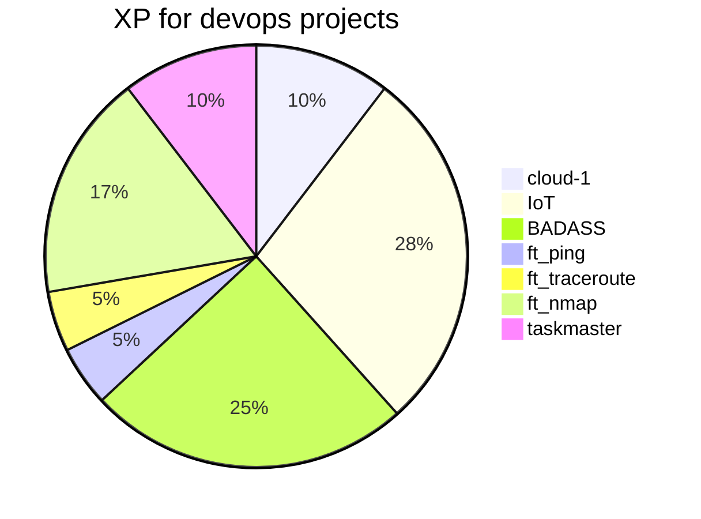
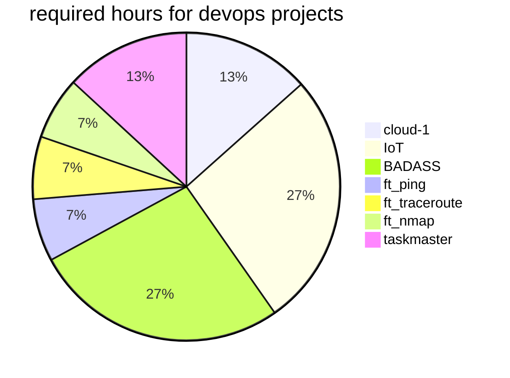
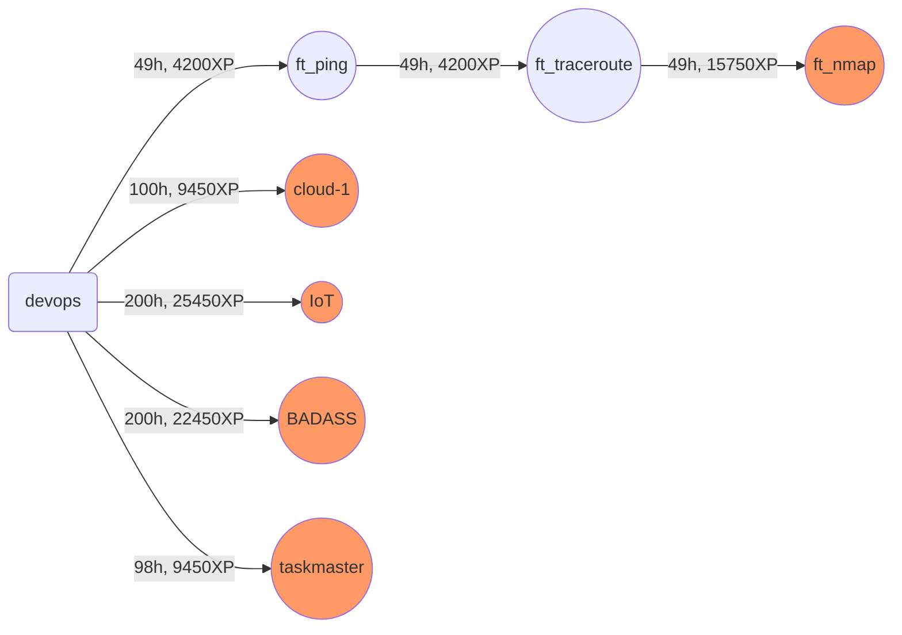

##  Devops branch

<table>
<tr><th>Project</th><th>Team</th><th>Time</th><th>XP</th><th>Description</th></tr>
<tr><td>cloud-1<td>Group 1-2<td>100h<td>9450<td>This project is an introduction to cloud servers.</tr>
<tr><td>Inception-of-Things<td>Group 2-3<td>200h<td>25450<td>This project aims to introduce you to kubernetes from a developer perspective. You will have to set up small clusters and discover the mechanics of continuous integration. At the end of this project you will be able to have a working cluster in docker and have a usable continuous integration for your applications.</tr>
<tr><td>Bgp At Doors of Autonomous Systems is Simple<td>Group 2-3<td>200h<td>22450<td>The purpose of this project is to deepen your knowledge of NetPractice. You will have to simulate several networks (VXLAN+BGP-EVPN) in GNS3.</tr>
<tr><td>ft_ping<td>Solo<td>49h<td>4200<td>Re-coding the ping command will let you get acquainted with TCP/IP communication between two machines on a network.</tr>
<tr><td>ft_traceroute<td>Solo<td>49h<td>4200<td>Re-coding the traceroute command will be the opportunity to deepen your knowledge of TCP/IP networks by following the paths of an IP packet from one machine to another.</tr>
<tr><td>ft_nmap<td>Group 2<td>49h<td>15750<td>Re-coding the nmap command will be the opportunity to deepen your knowledge of TCP/IP networks and thus understand advanced use of threads in real life.</tr>
<tr><td>taskmaster<td>Group 2<td>98h<td>9450<td>This program is a job control task, in any language. The project is very close to the supervisor program on your computer.</tr>
</table>

### Devops branch

